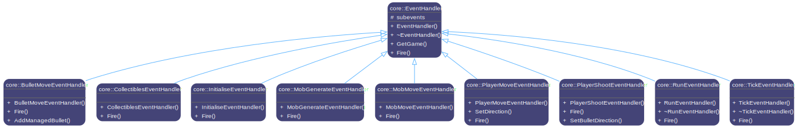

# SHOOT!🔫🔫🔫

<p align="center">
   
   <br/>
   <span> ENGG1340 Group 1 Presents (2024/25 Spring Semester)</span>
</p>

## Team Members (alphabetically)

- CHAN, Ho Nam (3036235352) [@ConanChan0113](https://gihub.com/ConanChan0113)
- LEUNG, Ming Ngai (3036393221) [@ThomasL956](https://github.com/ThomasL956)
- LIU, Jia Lin (3036391493) [@Kylineason-Liu](https://github.com/Kylineason-Liu)
- SHING, Zhan Ho Jacob (3036228892) [@ShingZhanho](https://github.com/ShingZhanho)
- SONG, Sizhe （3036457247）[@TIP-SoNg](https://github.com/TIP-SoNg)
- XIN, Yucheng (3036289755) [@Scevenate](https://github.com/Scevenate)  

##  

Welcome to _SHOOT!_, a high-octane, adrenaline-fueled shooting game where quick reflexes, sharp aim, and tactical thinking are your only keys to survival! [_Journey of the Prairie King_](https://stardewvalleywiki.com/Journey_of_the_Prairie_King), a minigame, provided just enough inspiration for the production of _SHOOT!_. Step into a deadly arena where monstrous foes emerge relentlessly from every direction, and your mission is simple: **shoot to survive, survive to dominate**.

## Table of Contents

- [**The Battlefield Awaits**](#The-Battlefield-Awaits)
- [**Rules of Survival**](#Rules-of-Survival)
- [**Features That Will Keep You Hooked**](#Features-That-Will-Keep-You-Hooked)
- [**How to Play**](#How-to-Play)
- [**Technical Details**](#Technical-Details)

## The Battlefield Awaits

You are the lone warrior in a hostile arena, armed with nothing but your wits and a powerful gun. The arena is a grid-based battleground where every pixel could mean life or death—walkable terrain, deadly monsters, or you, the last line of defense. Monsters spawn unpredictably from the four boundaries, forcing you to stay alert, move strategically, and fire with precision.

## Rules of Survival

_SHOOT!_ is straightforward enough but brutally intense:  

* 1️⃣ **Eliminate or be eliminated**: Monsters will keep coming and your job is to gun them down before they overrun you.
  
* 2️⃣ **One mistake can be fatal**: Some monsters are faster, tougher, or deadlier than others. Learn their behaviors or face a quick defeat.  
  
* 3️⃣ **Score to win**: Every kill adds to your score. Push your limits, beat your high score, and prove your dominance.  
  
* 4️⃣ **No Escape**: The arena is locked! Fight until the last monster falls… or until you do.  

## Features That Will Keep You Hooked

* 1️⃣ **Monster mayhem-no two enemies are the same**: Randomized spawn is based on generating random numbers in every round. Every monster in the wild arena will or will not be identical. You may never face the same wave twice. Some creatures charge recklessly, while others lurk and strike when you least expect it. Adapt or perish—the arena shows no mercy.🤔  
  
* 2️⃣ **Fully customizable arenas**: Why stick to the default battlefield when you can design your own? _SHOOT!_ is equipped with file I/O which allows you to import custom map files, and set up your own initial player position. The freedom is in your hands.🗺️
(Checkout the [syntax for the custom map file](#syntax-for-the-custom-map-file) section for more details.)
  
* 3️⃣ **Difficulty levels for every player**: Whether you are a novice seeking a gentle introduction to the chaos, a veteran who survives relentless waves and is equipped with precise skills, or a elite shooter, 
there is always a difficulty level just for you. In each level, the monster spawn rates, their speed and their amount are always changing. Get ready to push your limits and conquer the arena!😁
  
* 4️⃣ **Dynamic combat–fast, fluid, and ferocious**: Bullets fly, monsters swarm, and every second counts. The game’s smooth mechanics ensure that your skill—not luck—determines victory.😈
  
* 5️⃣ **Glory of the achievers**: After each round, your score is automatically stored into the leaderboard. Compete against yourself or others. How long can you last? How many monsters can you slay before the 
inevitable end? The leaderboard awaits the boldest shooters.🥇🥈🥉 
  
**Lock and load. The hunt begins now**. Dare to enter the arena? The monsters are waiting…👿

## How to Play

Clone the repository, then change your working directory to `build`:
   ```bash
   cd build
   ```
`make` the target:
   ```bash
   make all
   ```
Run the program:
   ```bash
   ./main
   ```
   Please note that:
> * `make run` is a shortcut for `make all` and `./main`.  
> * Add platform suffix to the target if you are not building on Linux. For example, use `make all_macos` or `make run_macos` for macOS. The supported suffixes are `_macos` and `_windows`.  
> * The executable on Windows is `main.exe`.

The minimum required size of the terminal is 107 x 39. Make sure your terminal is large enough! After you executed `./main`, you will see the home page of _SHOOT!_ as follows:
<p align="center">
   
   <br/>
</p>

You can navigate and interacti with the user interface either with your mouse or keyborad.

<p align="center">
   
   <br/>
</p>

❗If you want a swift win, do keep in mind the move speed, HP, damage and reward points of each type of mobs:

<div align="center">

| Icon | Mob | Speed (seconds/step) | HP | Damage | Reward Points |
|:------:|:----|:---------------------|:---|:-------|:--------------|
| Z | Zombie | 1 | 1 | 1 | 1 |
| T | Troll | 2 | 5 | 2 | 5 |
| z | Baby Zombie | 0.5 | 1 | 1 | 2 |
| M | Monster | 0.5 | 10 | 5 | 10 |
| B | Boss | 4 | 1000 | 50 | 100 |

</div>

How to move your figure and fire those bullets at the dreadful monsters? Here it is:

<div align="center">

| Key | Operation | Key | Operation | Key | Operation | Key | Operation |
|:---:|:----------|:---:|:----------|:---:|:----------|:---:|:----------|
| W | Move up | Q | Move left-up | I | Fire up | U | Fire left-up |
| A | Move left | E | Move right-up | J | Fire left | O | Fire right-up |
| S | Move down | Z | Move left-down | K | Fire down | M | Fire left-down |
| D | Move right | C | Move right-down | L | Fire right | . | Fire right-down |

</div>

Don't forget you are also able to click the `space` key to fire at all eight directions. Screw you monsters!😜
The Energy Drink gives you extra HP according to the value it stated, and Strengthen Potion enables you to deal more damage to mobs than usual. If you pick up the sheild, the mobs cannot see you for a period of time.  
Last reminder, the boost potions and sheilds do not only have effect on you, but also the mobs, if they catch the buffs before you do. Be careful!😲  
Alright, stay cool and have fun!


## Technical Details

### Coding Requirements

All the coding requirements for the course project have been met:

* ✅ **Random event generation**: Monster generation, collectible generations, etc. all depend on random numbers.

* ✅ **Data structures**: The game uses STL containers such as `std::list`, `std::vector`, `std::unordered_map`.
  
* ✅ **Dynamic memory management**: Most objects are created at runtime using `new` and destructed using `delete`. For example, in arena_reader.cpp, a dynamic `arena` instance is created based on user defined map if the input map file is valid.
  
* ✅ **File I/O**: _SHOOT!_ supports loading a custom map from a file. It also generates a `game.log` to facilitate development process.
  
* ✅ **Program codes in multiple files**: The project separates the components into multiple files and multiple namespaces, such as `core` and `util`, to adopt a modular design.
  
* ✅ **Multiple difficulty levels**: There are different difficulty levels to choose from. Novice can start practising on the easiest level, whereas veterans are able to choose higher levels featuring more frequent monster generation and stronger monsters to shoot.

### Non-standard Libraries

The program uses the following libraries:

* [`FTXUI`](https://github.com/ArthurSonzogni/FTXUI): for building a responsive, interactive user interface.
* POSIX thread (`pthread`): for supporting multithreaded game logics.

### Syntax for the Custom Map File

You can load your own map file to play. Select `Load a Custom Game` from the difficulty
menu, and type in the path of the map file, either absolute or relative (to the path
of the executable).

To create your own map, note the following:
1. The map file must be a text file.
2. The map size must be 102 (width) x 32 (height).
3. The game reads only the first 32 lines of the file, and only reads the first
   102 characters of each line. Anything beyond that will be ignored.
4. If the number of lines/characters is less than the required size, the missing
   characters will be implied as ` ` (space).
5. You can use one of the following characters to represent each pixel:
   - ` ` (space): air
   - `X`: wall
   - `P`: starting position of the player (each file MUST have exactly one)

   No other characters may be used or the game will report a syntax error.
6. The outermost layer will always be set as a wall no matter what you specify in the map file.
7. Do not create an enclosed area on the map. This may lead to undefined behaviour.

### Core Components

_SHOOT!_ relies heavily on Object-Oriented Programming and polymorphism. Almost
all core components are implemented as classes. The most important claases are
`Entity` and `EventHandler`. Their inheritance hierarchy are shown in this diagram:

<p align="center">


<br/>


</p>
